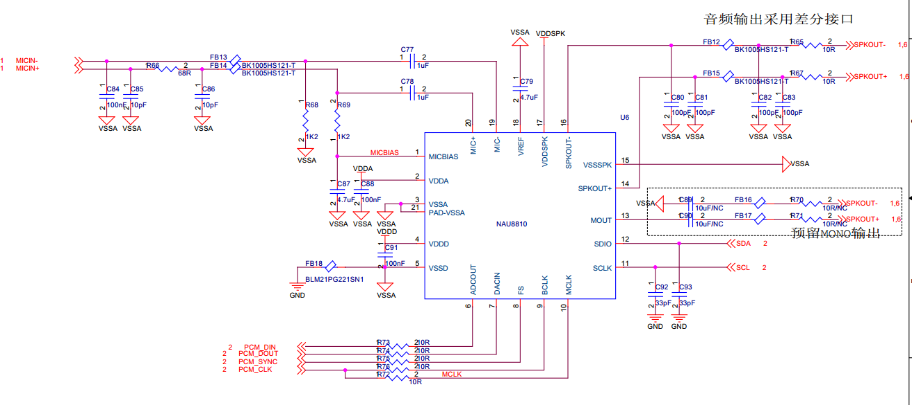
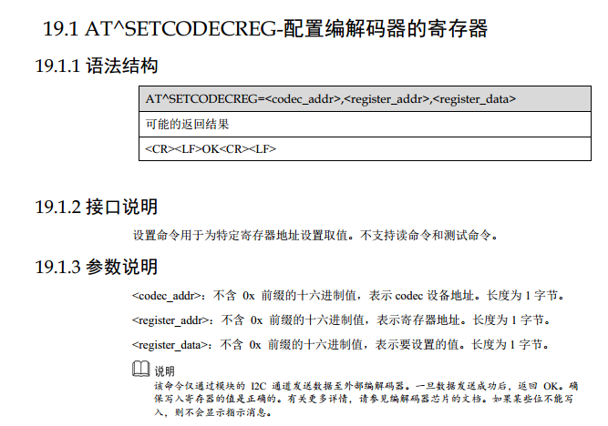
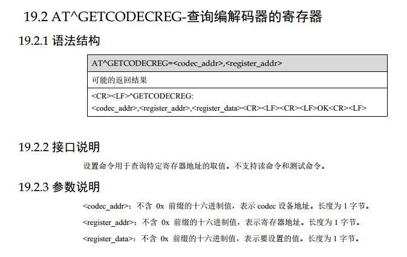
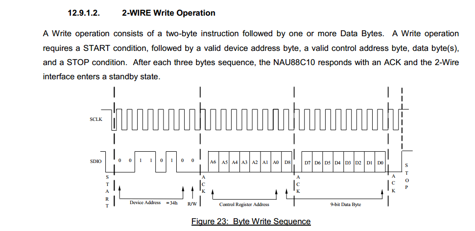
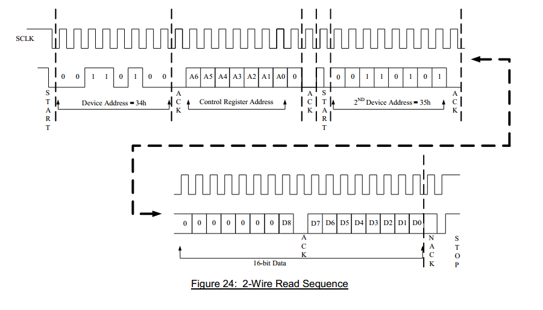

## 需求
5G模组供应商这边说支持打电话功能（模组有PCM输出），但是没有配套的codec解决方案，所以需要我们自己使用 codec 接受 PCM 音频


## 硬件设计




## 调试
调试分为两个部分
1. 通过 AT 指令拨打、接收电话。这个是标准的。
2. 通过 AT 指令配置 codec 的寄存器。这个是华为私有的。

### AT 指令测试
上位机（Ubuntu16.04）和 华为5000-31模组的USB接口接上后。
```
ls /dev/ttyUSB*
```
可以看到 
```
ttyUSB0 ttyUSB1 ttyUSB2 ttyUSB3
```
根据华为的手册描述 AT 指令是通过 PCUI端口也就是 ttyUSB1 进行交互

所以我通过 
```
cat /dev/ttyUSB1 
```
进行监听 AT 指令的接受。
通过 
```
echo "ATI" > /dev/ttyUSB1
```
进行 AT 指令的发送。


```
# 发送查询模组信息命令
echo "ATI" >/dev/ttyUSB1
# 查看模组返回信息
Manufacturer: Huawei Technologies Co., Ltd.
Model: MH5000-31
Revision: 11.770.00.03.00
IMEI: 867395040011807
+GCAP: +CGSM,+DS,+ES
```
### 1. 电话功能调试
电话拨号、接听 等功能和标准的 AT 指令一样
```
# 拨号
echo "ATD13212341234;" >/dev/ttyUSB1
# 接听
echo "ATA" > /dev/ttyUSB1
# 挂断: 0 为所有用户
echo "ATH0" > /dev/ttyUSB1
```

### 2. 音频功能调试
先看模组支持的 codec 相关的命令

```
AT^SETCODECREG=<codec_addr>,<register_addr>,<register_data>
```


```
AT^GETCODECREG=<codec_addr>,<register_addr>
```



再看 Codec  NAU88C10 的寄存器表，先随便找一个


#### 麻烦1
这里就看到麻烦了，**5000-31模组对 Codec register 的读和写都只支持 1byte 也就是 8bit。
但是 Codec 的 register data 却是 9 bit（0-8）**。

仔细研究一下 Codec 的 i2c write 操作：



可以看到 register_addr 是 A6-A0 ，register_data 是 D8-D0
所以我们只需要将真实希望去操作的寄存器地址位左移1bit，再加上 D8, 作为 register_addr 给 5000-31 模组去调用。

比如：
我希望去写 0x01 ，写入 0x11f = 1 0001 1111
那么我实际模组应该使用的参数为 
<codec_addr>=1a,
<register_addr>=01左移1bit为 02, 加上D8为1,最后得3
<register_data>=D7-D0 也就是 1f。
对应的 AT 指令为
```
AT^SETCODECREG=1a,3,1f
```

再来一组数据你们感受一下
```
[8810/Audio Control] 
0x4 = 0x58
0x5 = 0x0
0x6 = 0x0
0x7 = 0xa
0xa = 0x8
0xb = 0xff
0xe = 0x0100
0xf = 0xff
```
对应的 AT 指令是
```
echo "at^setcodecreg=1a,4,58" > /dev/ttyUSB1
echo "at^setcodecreg=1a,5,00" > /dev/ttyUSB1
echo "at^setcodecreg=1a,6,00" > /dev/ttyUSB1
echo "at^setcodecreg=1a,7,a" > /dev/ttyUSB1
echo "at^setcodecreg=1a,a,8" > /dev/ttyUSB1
echo "at^setcodecreg=1a,b,ff" > /dev/ttyUSB1
echo "at^setcodecreg=1a,e,00" > /dev/ttyUSB1
echo "at^setcodecreg=1a,00,ff" > /dev/ttyUSB1
```

#### 麻烦2
不知道是否写成功了。 因为5000-31模组的读取，同样是1个字节，而 Codec 被读的时候，返回的是两个字节。
因为我们从 Datasheet 可以看到



Codec 先返回的1个字节是高位。
所以 AT 指令 GETCODECREG 获得的返回数据为 高1个字节。

没办法，只能**使用逻辑分析仪抓取 I2C 数据。看实际是否写入成功。**
一般来说，AT 指令如果返回的是 OK  ，那么写入应该就是成功的。

#### 麻烦3 Codec 的寄存器配置问题
因为 Codec FAE 给到的寄存器配置表有误，所以导致 Mic 和 Speaker 都没有声音。在这块耽误了有快一天的时间。

这里就是相对独立的 Codec 调试阶段了。根据通道配置各个寄存器。不再赘述。