title: ROS_深度相机传感器调研
date: 2020-7-23 21:00:00
tags: Robot,机器人,

---

本文的观点大部分来自于网络搜集的论文、杂志、博客。
是个人的学习阶段整理的资料，如果错误还望海函指正。

[TOC]

深度相机主流的有三种类型：
* TOF 
	* i-ToF
	* d-ToF
* 双目
	* RGB 双目
	* IR 双目
* 结构光
	* 单目IR+投影IR点阵
	* 双目IR+投影IR点阵
	* 单目IR+投影相移条纹
 
 
 后文是对比三种主流相机的各项指标。
 包括：
 ```
#### 工作原理
#### 硬件指标
#####  功耗
#####  测量精度
#####  分辨率
#####  帧率
#####  量产标定
#### 技术瓶颈
 ```
 
 ### ToF
更详细的资料参考：https://blog.csdn.net/dianmao0917/article/details/17389637
计算机视觉life：https://blog.csdn.net/electech6/article/details/78349107

 ToF 全称 Time-of-Flight ，分为 
 i-ToF(indirect Time-of-Flight) 相位测距
 d-Tof(direct Time-of-Flight）时间测距

#### 工作原理
ToF 技术测量相机是指主动投射出的光束经过目标表面反射后被相机接收这个过程的来回的飞行时间，基于光速即可获得目标到相机的距离。
ToF 传感器给到光源驱动芯片调制信号，调制信号控制激光器发出高频脉冲调制(CW正弦 / PL脉冲)的近红外光，遇到物体漫反射后，接收端通过发射光与接收光的相位差或时间差来计算深度信息。
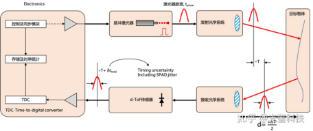

根据调制的方法不同，一般可以分为两种：脉冲调制（Pulsed Modulation）和连续波调制（Continuous Wave Modulation）。更深入的参考 计算机视觉life：https://blog.csdn.net/electech6/article/details/78349107 的资料。

其中 i-ToF 是根据 CIS（Camera Image Sensor）获取到的模拟信号进行测距。
其中 d-ToF 是根据 SPAD Array（单光子雪崩二极管阵列）获取的数字信号进行测距。

#### 硬件指标
##### 功耗
ToF 的方案功耗偏高，全面照射，且高频脉冲。
i-ToF 的功耗高
d-ToF 的功耗中

#####  测量精度
和距离呈线性关系
在厘米级别

#####  分辨率
一般达不到 VGA（640x480）

#####  帧率
高 100+ fps

##### 量产标定
i-ToF 麻烦
d-ToF 中等

#### 技术瓶颈
1. 飞点噪声（Flying pixels）
每个像素都具有一定的物理尺寸，在测量物体边缘时，单个像素会同时接收到前景和背景反射回来的光线；二者产生的能量叠加在一起，使得传感器获取的原始数据中包含多个距离的信息，解算相位计算距离时将得到错误的深度测量值。
导致物体边缘处往往存在大量错误的深度测量值，生成3D点云后,视觉上表现为飞在空中的无效点。
即无法有效获取物体边缘的3D信息。
通过边缘检测算法解决。
2. 多径干扰（Multi-Path Interference，MPI）
真实场景中存在复杂的漫反射甚至镜面反射，
导致原理上会使得测量值变大，严重影响三维重建的效果。
无法解决。
3. 强度误差（Intensity Realted Error）
同一平面上不同反射率的区域体现出不同的深度。
4. 远距离-高精度矛盾（Trade-off between range and precision）
5. 高频驱动
为了保证测量精度，CW-iToF采用提高调制频率的方式，PL-iToF则采用窄脉冲高峰值功率的驱动方式。综合起来，iToF对于驱动芯片的主要需求是高调制频率和高峰值功率。
6. 片上集成
主流的i-ToF传感器像素一般在QVGA（320x240）上下


### 双目

#### 工作原理
三角几何视差来获得目标到相机的距离信息。
具体的说，就是从两个相机观察同一物体，被观测物体在两个相机中拍摄到的图像中的位置会有一定位置差。
距离越近，视差越大。在已知两个相机间距等相对位置关系的情况下，即可通过相似三角形的原理计算出被摄物到相机的距离。

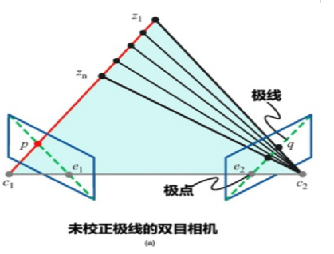

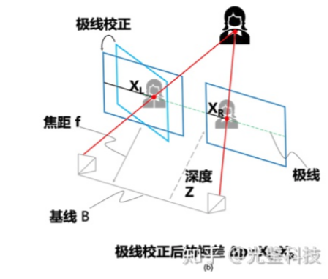

#### 硬件指标
##### 功耗
低～高 都有，大部分功耗比较低
#####  测量精度
近距离有着很高的精度，但是误差会随着距离增大而平方变大。
近距离可达毫米级别。
#####  分辨率
RGB双目 可达2k分辨率
#####  帧率
高60fps
##### 量产标定
容易
#### 技术瓶颈
1. 计算量大。
通过加算法芯片 ASIC 解决。
2. 依赖被摄物体纹理和环境光照。
比如白墙，无法匹配对应像素的问题。

### 结构光
#### 工作原理
原理本质和双目的一样，也是使用三角法。
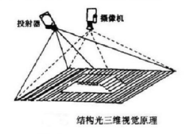

单目IR+投影IR点阵
双目IR+投影IR点阵
单目IR+投影相移条纹

#### 硬件指标
##### 功耗
中，需要投射图案，只照射局部区域
#####  测量精度
近距离有着很高的精度，但是误差会随着距离增大而平方变大。
近距离可达毫米级别。
#####  分辨率
可以达到1080P
#####  帧率
低 30fps
##### 量产标定
中等难度
#### 技术瓶颈
1. 高计算量。
通过加算法芯片 ASIC 解决。
2. 深度突变处的数据缺失
通过基于 ARM 的软核算法即可解决。
 

 ### 市场主流方案
 Microsoft、Intel、Leap Motion、Orbbec、图漾、Occipital Structure、Stereolabs 、DUO。
####  Intel Realsense R200
类型：双目IR
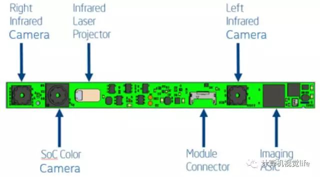
红外投射器投射出红外散斑，左右两个红外相机采集两张红外图像，处理器根据两张红外图像中的散斑特征点匹配计算视差图，最终得到深度图。

距离：室内0.5m-3.5m，室外最远10m。
应用场景：室内。室外受环境光照影响较大（红外发射器功率有限）

SDK兼容性很强，支持 C++, C#, JavaScript, Processing, Unity, 和Cinder等框架。需要说明的是， R200的SDK只支持人脸跟踪、不支持手势跟踪和骨架跟踪。

#### Intel Realsense SR300 
类型：双目结构光（官方叫编码光）
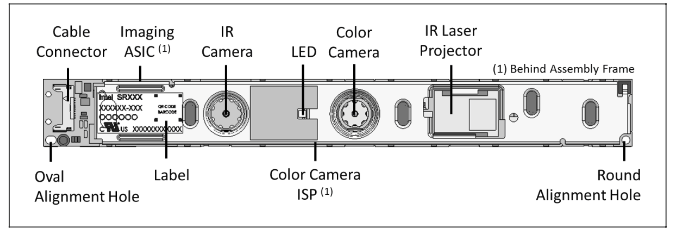


距离：0.2-1.5米
应用场景：脸部、手部跟踪。笔记本电脑、Pad、虚拟现实设备。

介绍：
https://www.intelrealsense.com/coded-light/
论坛：https://community.intel.com/t5/tag/Intel%C2%AE%20RealSense/tg-p/tag-id/513
采购：
https://store.intelrealsense.com/buy-intel-realsense-depth-module-sr300.html

#### Intel Realsense D435
类型：结构光（主动立体IR）


距离：0.1-10米
介绍：
https://www.intelrealsense.com/zh-hans/depth-camera-d435/


#### 乐动 TOF IDC3224R_LD01
3D TOF 高分辨率深度摄像头

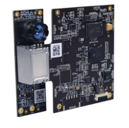

范围：0.2-4米
分辨率：320x240
FOV：92°X 74°X 57°

应用场景：机器人精准定位与建图、导航与避障、人脸/肢体/物体识别、AR/VR等。
介绍：https://www.ldrobot.com/product/43

#### Microsoft Kinect V1 V2
V1 是基于结构光
V2 是基于 TOF
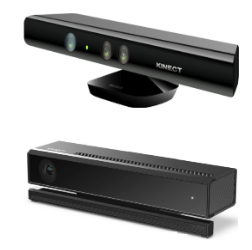
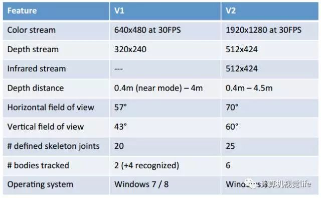

V1 已经停产
V2 支持 六个人的骨架追踪、基本的手势操作和脸部跟踪，支持 Cinder 和 Open Frameworks，并且具有内置的Unity 3D插件

#### 乐视LeTMC-520 （实际是奥比中光做的）
三目相机
IR投影 


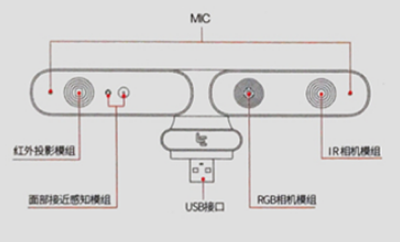

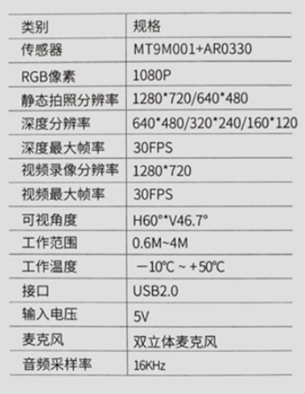

#### Orbbec Astra
奥比中光有：Orbbec Astra、Orbbec Astra Mini、Orbbec Persee
比如第一代 Orbbec Astra 和 Pro
类型：IR结构光
深度图都是 VGA（640×480）分辨率 @30FPS。不同之处在于彩色相机的分辨率， Astra提供的是 VGA@30FPS，而 Astra Pro 是 720p@ 30 FPS

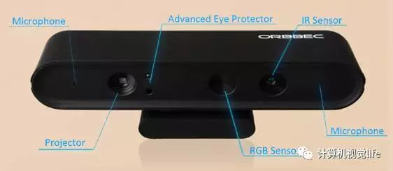

SDK比较简单，支持基本的手势跟踪，可以用于手势识别的人机交互，但是不支持骨架提取。最远测量范围可达8m。因此，Orbecc Astra比较适合室内较远距离的应用场景。不过，该设备只支持基于C++的 OpenNI 框架。
官网：https://orbbec3d.com/

#### Orbbec Astra  Mobile 3D camera
为了满足小型手持终端的3D视觉要求，Orbbec成功开发了Astra Mobile 3D摄像机，以满足移动/平板电脑制造商的多种应用场景。
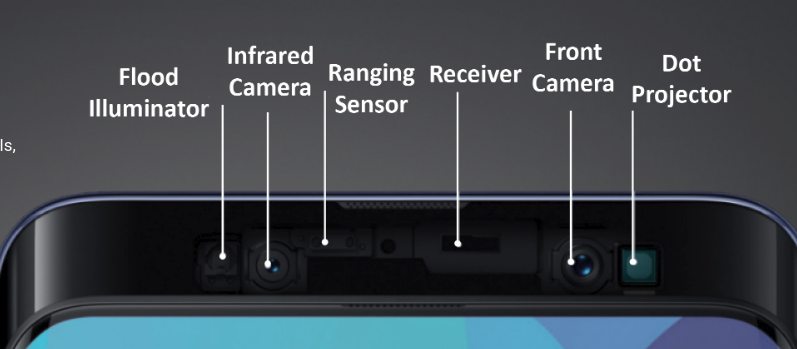
找不到方案的具体购买链接

https://orbbec3d.com/mobile/


#### 图漾 RGBD 系列 FS830-HD
类型：主动红外双目深度相机（带RGB）
https://item.taobao.com/item.htm?spm=a1z10.1-c-s.w4004-18920235119.6.5f2214a9IyeoVQ&id=591956273890
USB2.0消费等级相机,HD深度分辨率,720P RGB分辨率,RGB对齐,适合机器人避障,刷脸,活体检测等应用.

RGB-D对齐：是
功耗：IDLE 1.5／WORK 3.5／TRIGGER 3.0
输出接口：USB
工作范围：240~3500mm
深度分辨率：1280x960
深度帧率：15
RGB分辨率：2592x1944
基线距离：25
数据单位mm：1.0
同步采集：是
具有RGB：是

支持Windows、Linux、Android、ROS 平台。且多设备同时工作无干扰。适合对帧率要求不高的远距离应用场景。（已确认，本款不支持 Android）	
简介：https://www.percipio.xyz/dev_detail/?model_id=288
官网：https://www.percipio.xyz/
采购链接：https://shop564213940.taobao.com/

#### Occipital Structure
https://structure.io/

#### 更多
https://zhuanlan.zhihu.com/p/32375622
Microsoft、Intel、Leap Motion、Orbbec、图漾、Occipital Structure、Stereolabs 、DUO